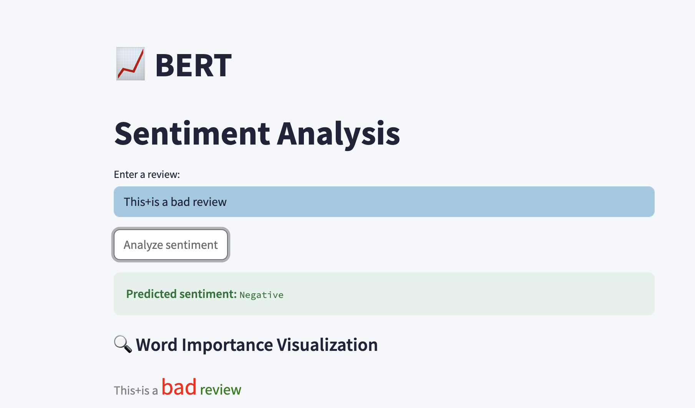

#  SentiScope

**SentiScope** is a sentiment analysis and explainability platform designed to empower both consumers and businesses to analyze product reviews and understand **why** a sentiment decision was made. It provides an API that supports two models: Logistic Regression and BERT, along with interpretability features.

> Visit the [website](https://sentiscope.streamlit.app/)

---

## 🎯 Project Goals

1. **Sentiment Analysis**: Classify user-provided product reviews as _positive_ or _negative_ using ML models.
2. **Explainable AI**: Provide visual insights into which parts of the review influenced the model's prediction.

---

## 🛠️ Tech Stack

- **Backend**: Python, FastAPI
- **Models**:
  - Logistic Regression + TF-IDF Vectorizer
  - BERT Transformer (fine-tuned)
- **Training Data**:
  - 3.6M Amazon reviews for training
  - 400K Amazon reviews for testing
- **Explainability**:
  - TF-IDF coefficient-based word importances for logistic regression
  - LIME-based explanation for BERT
- **Serving**: Dockerized API for production deployment

---

## 🚀 Getting Started

### 1. Clone the repository

```bash
git clone git@github.com:Jojo2813/sentiscope.git
cd sentiscope
```

### 2. Install dependencies

```bash
pip install -r api_requirements.txt
```

### 3. Train or add models

You can either train new models or add pre-trained ones into the `/models`
folder. The Logistic Regression model requires a TF-IDF vectorizer.

### 4. Run the API

You can run the API locally or via Docker.

**Locally:**

```bash
uvicorn sentiscope.api.fast:app --host 0.0.0.0 --port 8000
```

---

## 🔗 API Endpoints
> ✨ *Use the [API](https://sentiscope-811189409150.europe-west1.run.app/)*

| Method | Endpoint               | Description                      |
|--------|------------------------|----------------------------------|
| POST   | `/text_ml`      | Predict using Logistic Regression |
| POST   | `/text_dl`        | Predict using BERT Transformer     |
| GET  | `/predict`      | Predict using Logistic Regression |
| GET   | `/bert`        | Predict using BERT Transformer     |

Each response includes:
- `sentiment`: The predicted label (`positive` or `negative`)
- `contributions`: Contributions of each word of the review
- `top positive`: The 2 words with the highest positive contribution
- `top negative`: The 2 words with the highest negative contribution


Example `POST` request body:

```json
{
  "text": "This product is very bad!"
}
```

Example response:

```json
{
  "sentiment": "Negative",
  "contributions": {
    "bad": -0.8493822721233767,
    "This": -0.055178364859198456,
    "product": 0.04343707833940294,
    "very": -0.03596263800926295,
    "is": -0.0012366701874647191
  },
  "top_positive": [
    "product"
  ],
  "top_negative": [
    "bad",
    "This"
  ]
}
```

---

## 📊 Example Visualization

> ✨ *Visuals are rendered in the [frontend](https://github.com/Jojo2813/sentiscope_front) using the API’s explanation output.*




---

## 👨‍💻 Team
- **Jonas Jäger** [GitHub](https://github.com/JonasJaeger28)
- **Marc Vicente** [GitHub](https://github.com/marcvice9)
- **Vinod Kamisetti** [GitHub](https://github.com/vinodkamisetti)
- **Johannes Blass** [GitHub](https://github.com/Jojo2813)
---

## Going further
Feel free to visit the [about page](https://sentiscope.streamlit.app/about) of
our web application to find out moreabout the models used and training steps
taken.

---

## 📜 License

MIT License — see `LICENSE` file for details.
